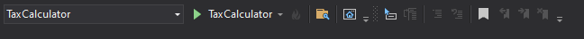

## How is the project organized?
All projects are within "src" for organizational reasons;

The project uses the basics of a DDD project - Domain Driven Design;

It has a console-type data entry project: "TaxCalculator";

It has the project "TaxCalculator.ApiModels" where external contracts are stored. ApiModels can be packaged to be reused as API contracts in the future;

The "TaxCalculator.Domain" is the domain where you have the business rule. The system core;

"TaxCalculator.Test" is for testing different parts of the system. In this project only tests the domain.

## Libraries
The project uses an external package called Newtonsoft to manipulate JSON.

Another external package called AutoMapper was installed to map one object to another. It is very useful in projects with API.

## Requirements
.Net 3.1 or higher ( https://docs.microsoft.com/en-us/dotnet/core/tools/dotnet-install-script#recommended-version )

### How to run the code?
#### Visual Studio:
It is necessary to open the file "TaxCalculator.sln" define the initial project: "TaxCalculator" and then press F5 or the "start" button with the name of the project.

#### VSCode
It is necessary to open the file "TaxCalculator.sln". 
Go to the terminal (ctrl + ')

cd src\TaxCalculator

dotnet run

#### Without IDE
Open prompt/powershell/bash

cd src\TaxCalculator

Type "dotnet run" and paste/enter the values ​​in JSON format;

or 

dotnet run '[{\"operation\":\"buy\", \"unit-cost\":10, \"quantity\": 10000}, {\"operation\":\"sell\" , \"unit-cost\":20, \"quantity\": 5000}]'

##### CMD 
TaxCalculator.exe '[{\"operation\":\"buy\", \"unit-cost\":10, \"quantity\": 10000}, {\"operation\":\"sell \", \"unit-cost\":20, \"quantity\": 5000}]'

##### Powershell 

.\TaxCalculator.exe '[{\"operation\":\"buy\", \"unit-cost\":10, \"quantity\": 10000}, {\"operation\":\ "sell\", \"unit-cost\":20, \"quantity\": 5000}]'